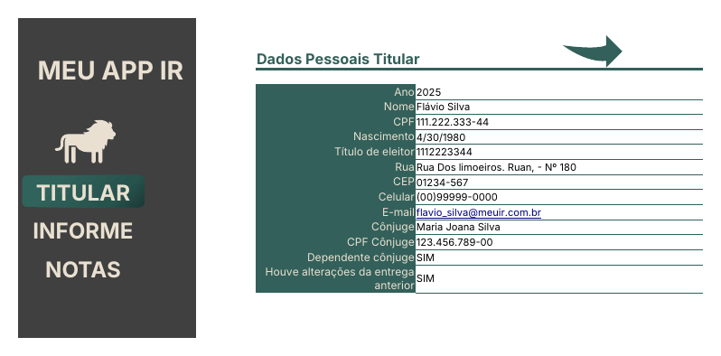
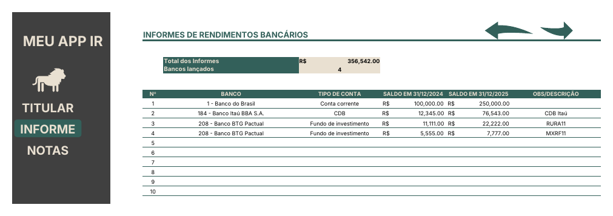
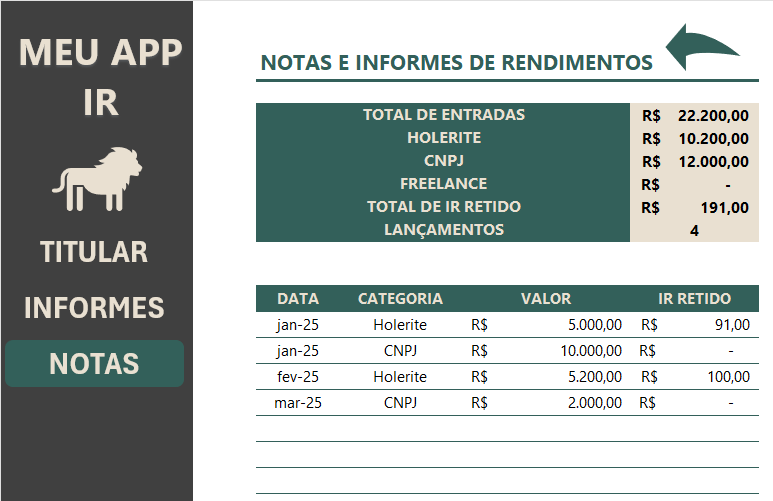

# Organizador de Declaração de Imposto de Renda (Excel)

Planilha em Excel para juntar, em um só lugar, tudo o que é preciso para preencher a declaração do IRPF: dados do titular, saldos de bancos e aplicações e os documentos de recebimento do ano. Projeto do desafio **Excel 2026 – DIO / Santander**.

> ⚠️ Todos os dados da planilha são **fictícios** (nome, CPF, endereço, bancos e valores). Nenhuma informação real foi publicada.

## Objetivo

Deixar a organização da declaração simples: abrir a planilha, preencher uma vez ao longo do ano e, na hora de declarar, ter os totais e a lista de documentos prontos.

## Telas

### 1. TITULAR
Dados pessoais de quem vai declarar (ano da declaração, nome, CPF, nascimento, título de eleitor, endereço, CEP, celular, e-mail, cônjuge e dependentes) e duas perguntas de sim/não (dependente cônjuge e se houve alterações desde a entrega anterior).



### 2. INFORMES (saldos de bancos e aplicações)
Registro do saldo de cada banco e aplicação em **31/12** do ano anterior e do ano da declaração. É daqui que saem os valores de *Bens e Direitos*.

- Banco escolhido em lista suspensa (50 bancos, no formato "código - nome").
- Tipo de conta em lista suspensa: conta corrente, poupança, CDB, LCI/LCA, fundo de investimento, previdência, ações e corretora etc.
- Cabeçalhos dinâmicos: os anos mudam sozinhos conforme o ano informado em TITULAR.
- Resumo no topo: total dos saldos do ano e quantidade de bancos lançados.



### 3. NOTAS (informes de recebimento)
Registro do que foi recebido durante o ano: holerites, rendimentos de CNPJ e freelances, com o valor e o IR já retido.

- Categoria em lista suspensa (Holerite, CNPJ, Freelance).
- Resumo no topo: total de entradas, total por categoria, total de IR retido e quantidade de lançamentos.



## Recursos do Excel usados

| Recurso | Onde |
|---|---|
| Menu lateral com botões de navegação (TITULAR / INFORME / NOTAS) | todas as telas |
| Setas de voltar/avançar entre as telas | INFORMES e NOTAS |
| Validação de dados (listas suspensas) | SIM/NÃO, bancos, tipo de conta, categoria |
| Aba de apoio oculta com as listas | `Apoio` |
| Formatos personalizados (CPF, CEP, celular, moeda, mês/ano) | TITULAR, INFORMES, NOTAS |
| Hiperlink de e-mail | TITULAR |
| Fórmula com texto dinâmico `="SALDO EM 31/12/"&TITULAR!D5` | cabeçalhos de INFORMES |
| `SOMA`, `CONT.VALORES`, `SOMASE` | resumos de INFORMES e NOTAS |
| Linhas de grade e cabeçalhos ocultos | aparência de aplicativo |

## Fórmulas principais

| Onde | Fórmula | O que faz |
|---|---|---|
| INFORMES `E6` | `=SOMA(G11:G20)` | total dos saldos em 31/12 do ano |
| INFORMES `E7` | `=CONT.VALORES(D11:D20)` | quantidade de bancos lançados |
| INFORMES `F10` / `G10` | `="SALDO EM 31/12/"&TITULAR!D5-1` | cabeçalho com o ano anterior / atual |
| NOTAS `F5` | `=SOMA(E14:E32)` | total de entradas |
| NOTAS `F6:F8` | `=SOMASE(D14:D32;C6;E14:E32)` | total por categoria |
| NOTAS `F9` | `=SOMA(F14:F32)` | total de IR retido |
| NOTAS `F10` | `=CONT.VALORES(D14:D32)` | quantidade de lançamentos |

## Como usar

1. Abra `planilha/CONTROLE_IR.xlsx` no Excel.
2. Em **TITULAR**, preencha o ano e os dados pessoais.
3. Em **INFORMES**, escolha o banco e o tipo de conta e digite os saldos de 31/12.
4. Em **NOTAS**, lance cada recebimento com data, categoria, valor e IR retido.
5. Use o menu lateral para navegar entre as telas e confira os totais no topo.

## Estrutura do repositório

```
organizador-declaracao-ir/
├── README.md
├── images/
│   ├── tela_titular.png
│   ├── tela_informes.png
│   └── tela_notas.png
└── planilha/
    └── CONTROLE_IR.xlsx
```

## O que aprendi

- Montar um menu de navegação dentro do Excel, com aparência de aplicativo.
- Usar validação de dados com listas guardadas em uma aba de apoio oculta.
- Criar cabeçalhos dinâmicos ligados a uma célula de configuração.
- Aplicar formatações personalizadas para CPF, CEP, telefone e moeda.
- Organizar a planilha em telas com uma função clara cada uma.

## Autora

Helen — [@Helenh12](https://github.com/Helenh12)
